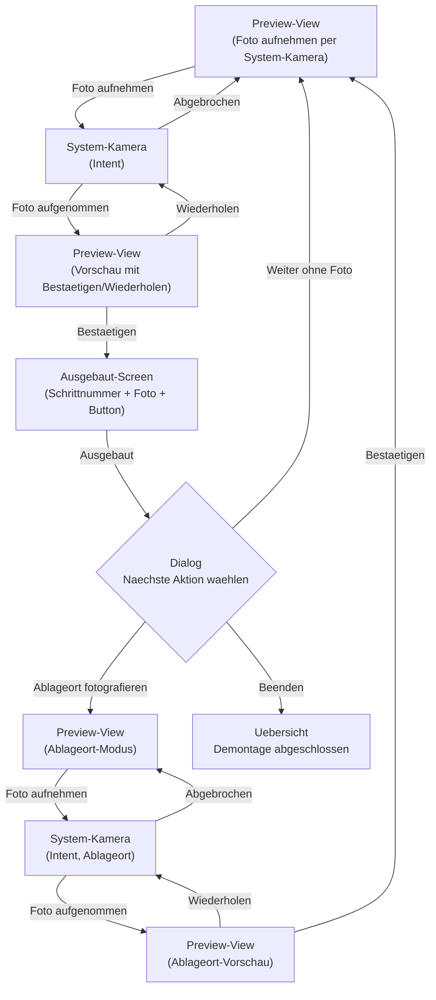

# F-003: Demontage-Flow

## Kontext

Der Demontage-Flow ist der Kernworkflow der App. Ein Mechaniker dokumentiert den Auseinanderbau eines Fahrzeugs Schritt fuer Schritt mit Fotos. Jeder Schritt wird sofort persistiert.

**Problem:** Ohne visuelle Dokumentation ist es schwierig, sich nach Tagen oder Wochen an die korrekte Reihenfolge und die Ablageorte der ausgebauten Teile zu erinnern. Handschriftliche Notizen sind unpraktisch (dreckige Haende) und fehleranfaellig.

**Loesung:** Schritt-fuer-Schritt-Fotodokumentation mit minimalem Interaktionsaufwand. Jeder Schritt wird sofort persistiert, sodass keine Daten verloren gehen (auch bei App-Unterbrechung durch Anrufe, leeren Akku etc.).

**Primaerer Nutzer:** Mechaniker in der Werkstatt, der ein Fahrzeug demontiert und dabei Handschuhe traegt, dreckige Haende hat und schnell arbeiten muss.

**Situation:** Der Mechaniker steht am Fahrzeug, hat gerade ein Bauteil identifiziert, das ausgebaut werden soll, und moechte den aktuellen Zustand dokumentieren bevor er weiterarbeitet.

Der Flow deckt zwei Sub-Workflows ab:
- **Bauteil ausbauen + ablegen**: Foto vom eingebauten Zustand, Bauteil ausbauen, optional Foto vom Ablageort
- **Arbeitsschritt am Fahrzeug**: Foto vom Zustand dokumentieren (z.B. Stecker getrennt), kein Ablageort noetig

## Domain-Konzepte

### Schritt-Definition

Ein **Schritt** entspricht einem eigenstaendigen Bauteil oder einer Baugruppe, die als Einheit ausgebaut wird. Der Mechaniker entscheidet selbst ueber die Granularitaet.

**Beispiele:**
- Bremsscheibe vorne links (inkl. aller Befestigungsschrauben) = 1 Schritt
- Bremssattel vorne links = 1 Schritt
- Kabelbaum-Stecker loesen = 1 Schritt (wenn er als separate Aktion dokumentiert werden soll)

**Nicht:** Einzelne Schrauben oder Kleinteile als separate Schritte, es sei denn der Mechaniker moechte es explizit.

### Schrittnummer-Konzept

Jeder Schritt erhaelt eine automatisch hochzaehlende **Schrittnummer** (1, 2, 3, ...). Die Schrittnummer dient zwei Zwecken:

1. **Fortschritts-Tracking:** Beim Zusammenbau (F-004) zeigt die Schrittnummer, wie weit der Mechaniker im Prozess ist (z.B. "Schritt 12 von 15, noch 3").
2. **Optionale Ablageort-Korrelation:** Der Mechaniker kann seine physischen Ablageorte mit den Schrittnummern beschriften. Die App erzwingt dies nicht, aber das Ablageort-Foto zeigt dann die Nummer auf dem physischen Label.

Es gibt mehr Schrittnummern als physische Ablageorte, weil manche Teile am Fahrzeug verbleiben (z.B. geloeste Kabel, die nur zur Seite gelegt werden).

### Schritt-Typen

Jeder Schritt hat einen **Typ**, der angibt, ob das Bauteil ausgebaut und abgelegt wurde oder am Fahrzeug verblieben ist:

| Typ | Bedeutung | Ablageort-Foto |
|-----|-----------|----------------|
| `AUSGEBAUT` | Bauteil wurde ausgebaut und an einem separaten Ort abgelegt | Ja (vorhanden) |
| `AM_FAHRZEUG` | Bauteil wurde abgebaut/geloest, verbleibt aber am Fahrzeug | Nein |

Der Typ wird implizit durch die Dialog-Auswahl gesetzt:
- "Ablageort fotografieren" -> `AUSGEBAUT`
- "Weiter ohne Ablageort" -> `AM_FAHRZEUG`

**Nutzen des Typs:**
- Farbliche Kennzeichnung der Schrittkette im Zusammenbau-Flow (F-004)
- Schritt-Preview ohne alle Fotos laden zu muessen (z.B. Icon-Darstellung)
- Schnelle Filterung: "Zeige nur Schritte mit Ablageort"

## Entity-Definitionen

### SchrittTyp (Enum)

```kotlin
enum class SchrittTyp {
    AUSGEBAUT,    // Bauteil ausgebaut und an separatem Ort abgelegt
    AM_FAHRZEUG   // Bauteil abgebaut/geloest, verbleibt am Fahrzeug
}
```

### Schritt (Room Entity)

```kotlin
@Entity(
    tableName = "schritt",
    foreignKeys = [ForeignKey(
        entity = Reparaturvorgang::class,
        parentColumns = ["id"],
        childColumns = ["reparaturvorgangId"],
        onDelete = ForeignKey.CASCADE
    )]
)
data class Schritt(
    @PrimaryKey(autoGenerate = true)
    val id: Long = 0,

    val reparaturvorgangId: Long,

    val schrittNummer: Int,                // Schrittnummer (1, 2, 3, ...) -- auto-increment

    val typ: SchrittTyp? = null,           // AUSGEBAUT oder AM_FAHRZEUG (null = Schritt noch nicht abgeschlossen)

    val bauteilFotoPfad: String? = null,   // Pfad zum Bauteil-Foto (Pflicht, initial null bei Schritt-Anlage)
    val ablageortFotoPfad: String? = null,  // Pfad zum Ablageort-Foto (nur bei typ = AUSGEBAUT)

    val eingebautBeiMontage: Boolean = false, // Wird von F-004 (Montage-Flow) auf true gesetzt

    val gestartetAm: Instant,              // Timestamp: Preview-View oeffnet sich fuer diesen Schritt
    val abgeschlossenAm: Instant? = null    // Timestamp: Dialog-Auswahl getroffen (null = unterbrochen)
)
```

**Hinweis:** `bauteilFotoPfad` ist initial `null` wenn der Schritt in der DB angelegt wird (beim Preview-View-Oeffnen). Der Pfad wird per Update ergaenzt, sobald das Foto bestaetigt wurde. Ein Schritt ohne `bauteilFotoPfad` ist ein Artefakt einer Unterbrechung und kann beim Fortsetzen mit neuem Foto befuellt werden.

**Hinweis:** `typ` ist initial `null` und wird erst bei der Dialog-Auswahl gesetzt. Ein Schritt mit `typ = null` ist ein nicht abgeschlossener Schritt (Unterbrechung vor Dialog-Auswahl).

## Foto-Ordner-Struktur

```
context.filesDir/
  photos/
    temp/          <- Nicht bestaetigte Aufnahmen (werden beim App-Start aufgeraeumt)
    bauteil_1.jpg  <- Bestaetigte Bauteil-Fotos
    ablageort_1.jpg <- Bestaetigte Ablageort-Fotos
    ...
```

**Cleanup-Regel:** Beim App-Start wird `photos/temp/` geleert. Bestaetigte Fotos in `photos/` bleiben dauerhaft.

## Uebergreifende Nicht-funktionale Anforderungen

### Debounce

Global 300ms fuer alle Buttons im Demontage-Flow (Handschuhe, Doppel-Tap-Schutz).

### Datensicherheit

- Fotos werden im app-internen Speicher abgelegt (nicht in der oeffentlichen Galerie)
- Keine Metadaten (GPS, Zeitstempel) werden in EXIF-Daten geschrieben (Datenschutz)

### Fehlende Fotos

Fehlende Foto-Dateien (z.B. nach Backup/Restore): Platzhalter-Bild in der Anzeige statt Crash.

### Bedienbarkeit

- Minimale Interaktion pro Schritt:
  - Ohne Ablageort: Foto aufnehmen -> Bestaetigen -> Ausgebaut -> Dialog = 4 Taps
  - Mit Ablageort: Foto aufnehmen -> Bestaetigen -> Ausgebaut -> Dialog -> Ablageort-Foto -> Bestaetigen = 6 Taps
- Schrittnummer immer sichtbar: In Preview-View und auf Ausgebaut-Screen
- Foto-Qualitaet: Mittlere Kompression, ~2-3 MB pro Foto (Balance zwischen Qualitaet und Speicher)

## Ordner-Inhalt

| Datei | Typ | Beschreibung |
|---|---|---|
| [views/preview.md](views/preview.md) | View-Spec | Preview-View: Foto-Aufnahme per System-Kamera + Vorschau mit Bestaetigen/Wiederholen |
| [views/ausgebaut.md](views/ausgebaut.md) | View-Spec | Ausgebaut-View: Schrittnummer + Foto + Button |
| [views/dialog.md](views/dialog.md) | View-Spec | Dialog-View: 3 gleichwertige Optionen |
| [workflow.md](workflow.md) | Workflow-Spec | State Machine, Transitions, Unterbrechung, Back-Block |

## Abhaengigkeiten

- **F-001** Vorgangs-Uebersicht: Einstieg in den Demontage-Flow
- **F-002** Vorgang anlegen: Erstellt den Reparaturvorgang, zu dem Schritte gehoeren

## Flow-Diagramm



## Sequenz-Diagramm

```mermaid
sequenceDiagram
    autonumber
    actor T as Techniker
    participant PV as Preview-View
    participant SK as System-Kamera
    participant F as Ausgebaut-Screen
    participant D as Dialog
    participant U as Uebersicht

    Note over T,U: Demontage-Dokumentation Workflow

    rect rgb(26, 35, 64)
        Note over T,SK: Phase 1: Foto von eingebautem Bauteil
        T->>PV: Oeffnet Preview-View (Schrittnummer sichtbar)
        T->>PV: Tippt "Foto aufnehmen"
        PV->>SK: System-Kamera Intent
        SK->>PV: Foto aufgenommen
        alt Wiederholen
            T->>PV: Tippt "Wiederholen"
            PV->>SK: System-Kamera erneut
            SK->>PV: Neues Foto aufgenommen
        end
        T->>PV: Tippt "Bestaetigen"
    end

    rect rgb(26, 51, 36)
        Note over T,F: Phase 2: Arbeit am Fahrzeug (MVP: Button)
        PV->>F: Ausgebaut-Screen anzeigen
        T->>F: Tippt "Ausgebaut"
    end

    rect rgb(51, 42, 26)
        Note over T,D: Phase 3: Naechste Aktion waehlen
        F->>D: Dialog oeffnet sich
        D->>T: Optionen anzeigen
        Note over D: 1) Ablageort fotografieren<br/>2) Weiter ohne Ablageort<br/>3) Beenden
    end

    alt Ablageort fotografieren
        rect rgb(26, 51, 56)
            Note over T,SK: Phase 4a: Foto vom Ablageort
            D->>PV: Preview-View (Ablageort-Modus)
            T->>PV: Tippt "Foto aufnehmen"
            PV->>SK: System-Kamera Intent
            SK->>PV: Foto aufgenommen
            Note over PV: Banner: "Ist das der Ablageort?"
            alt Wiederholen
                T->>PV: Tippt "Wiederholen"
                PV->>SK: System-Kamera erneut
                SK->>PV: Neues Foto aufgenommen
            end
            T->>PV: Tippt "Bestaetigen"
        end
    else Weiter ohne Foto
        Note over T,PV: Zurueck zu Phase 1 (naechstes Bauteil)
    else Beenden
        rect rgb(51, 26, 26)
            Note over T,U: Phase 5: Abschluss
            D->>U: Demontage abgeschlossen
        end
    end
```



## Offene Fragen

- [x] ~~UI-Hinweis "Ablageort fotografieren" -- Banner oberhalb der Vorschau~~ **Entschieden:** Frage "Ist das der Ablageort?" als Banner ueber der Foto-Vorschau in der Preview-View (Ablageort-Modus).
- [ ] **OFFEN:** Soll der Mechaniker im Ablageort-Modus ein bereits aufgenommenes Ablageort-Foto wiederverwenden koennen (z.B. mehrere Teile in derselben Kiste)? -> Fuer MVP: Nein, jedes Mal neues Foto. Spaeter: Foto-Vorschlaege aus Historie.

## Entschiedene Fragen (aus Original-Kern-Spec)

- [x] ~~Ablageort-Foto: Reicht nur Foto oder soll es zusaetzlich eine optionale Nummer/Beschriftung geben?~~ **Entschieden:** Keine manuelle Eingabe. Nur auto-increment Schrittnummer. Der Mechaniker kann seine physischen Ablageorte mit den Schrittnummern beschriften.
- [x] ~~Arbeitsphase: Umfang und Zeitpunkt der Erweiterung~~ **Entschieden:** MVP nur "Ausgebaut"-Button. Erweiterung (Timer, Kommentare, Sprachnotizen) kommt in separater Spec.
