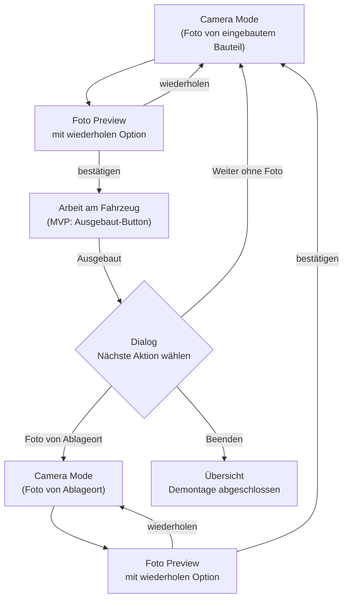

# F-003: Demontage-Flow

## Kontext

Der Demontage-Flow ist der Kernworkflow der App. Ein Mechaniker dokumentiert den Auseinanderbau eines Fahrzeugs Schritt für Schritt mit Fotos. Jeder Schritt wird sofort persistiert.

Der Flow deckt zwei Sub-Workflows ab:
- **Bauteil ausbauen + ablegen**: Foto vom eingebauten Zustand, Bauteil ausbauen, optional Foto vom Ablageort
- **Arbeitsschritt am Fahrzeug**: Foto vom Zustand dokumentieren (z.B. Stecker getrennt), kein Ablageort nötig

## Ordner-Inhalt

| Datei | Typ | Beschreibung |
|---|---|---|
| [F-003-kern.md](F-003-kern.md) | Spec (In Arbeit) | Foto-Loop, Navigation, Schrittzähler (MVP) |
| [F-003-arbeitsphase-ideen.md](F-003-arbeitsphase-ideen.md) | Ideensammlung | Zeiterfassung, Pausieren, Kommentare (Konzeptphase) |
| [F-003-alt-referenz.md](F-003-alt-referenz.md) | Referenz | Ursprüngliche Spec (vor Umstrukturierung) |

## Abhängigkeiten

- **F-001** Vorgangs-Übersicht: Einstieg in den Demontage-Flow
- **F-002** Vorgang anlegen: Erstellt den Reparaturvorgang, zu dem Schritte gehören

## Flow-Diagramm

## Sequenz-Diagramm

```mermaid
sequenceDiagram
    autonumber
    actor T as Techniker
    participant C as Camera Mode
    participant P as Foto Preview
    participant F as Fahrzeug
    participant D as Dialog
    participant U as Übersicht

    Note over T,U: Demontage-Dokumentation Workflow

    rect rgb(26, 35, 64)
        Note over T,P: Phase 1: Foto von eingebautem Bauteil
        T->>C: Öffnet Kamera
        C->>P: Foto aufgenommen
        alt wiederholen
            P-->>C: Foto erneut aufnehmen
            C->>P: Neues Foto aufgenommen
        end
        P->>T: Foto bestätigt
    end

    rect rgb(26, 51, 36)
        Note over T,F: Phase 2: Arbeit am Fahrzeug (MVP: Button)
        T->>F: Bauteil ausbauen
        T->>F: Click auf "Ausgebaut"
    end

    rect rgb(51, 42, 26)
        Note over T,D: Phase 3: Nächste Aktion wählen
        F->>D: Dialog öffnet sich
        D->>T: Optionen anzeigen
        Note over D: 1) Foto von Ablageort<br/>2) Weiter ohne Foto<br/>3) Beenden
    end

    alt Foto von Ablageort
        rect rgb(26, 51, 56)
            Note over T,P: Phase 4a: Foto vom Ablageort
            T->>C: Öffnet Kamera (Ablageort)
            C->>P: Foto aufgenommen
            alt wiederholen
                P-->>C: Foto erneut aufnehmen
                C->>P: Neues Foto aufgenommen
            end
            P->>T: Foto bestätigt
        end
    else Weiter ohne Foto
        Note over T,C: Zurück zu Phase 1 (nächstes Bauteil)
    else Beenden
        rect rgb(51, 26, 26)
            Note over T,U: Phase 5: Abschluss
            D->>U: Demontage abgeschlossen
        end
    end
```

## Offene Entscheidungen

- [ ] Ablageort-Foto: Reicht nur Foto oder soll es zusätzlich eine optionale Nummer/Beschriftung geben?
- [ ] Arbeitsphase: Umfang und Zeitpunkt der Erweiterung (eigene Spec)
