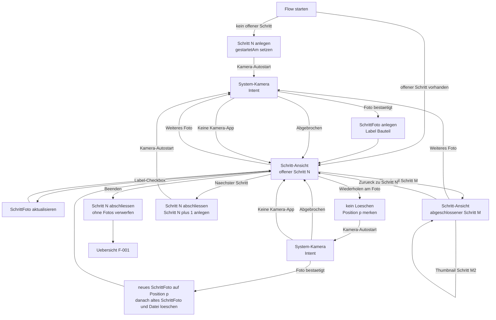
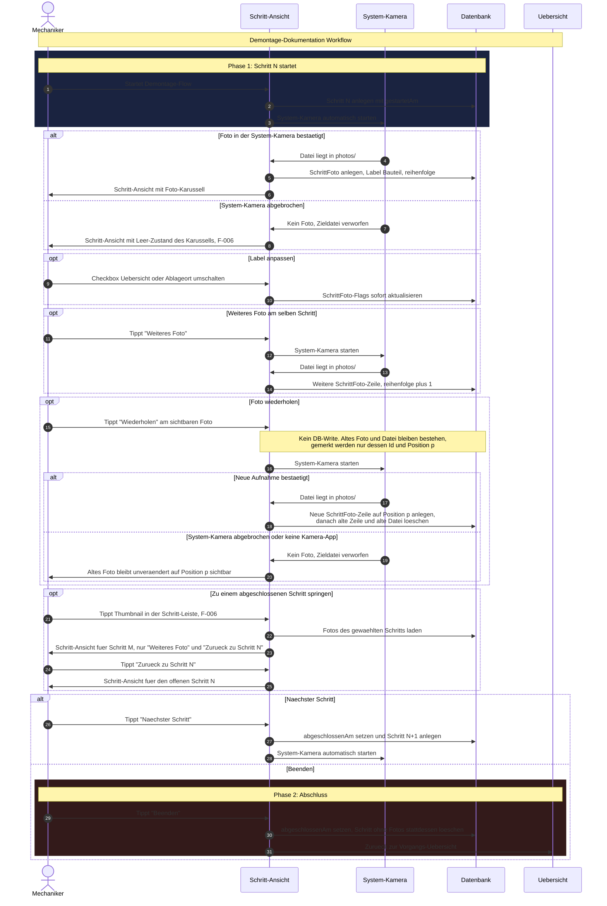

# F-003: Demontage-Flow

## Kontext

Der Demontage-Flow ist der Kernworkflow der App. Ein Mechaniker dokumentiert den Auseinanderbau eines Fahrzeugs Schritt fuer Schritt mit Fotos. Jeder Schritt wird sofort persistiert.

**Problem:** Ohne visuelle Dokumentation ist es schwierig, sich nach Tagen oder Wochen an die korrekte Reihenfolge und die Ablageorte der ausgebauten Teile zu erinnern. Handschriftliche Notizen sind unpraktisch (dreckige Haende) und fehleranfaellig.

**Loesung:** Schritt-fuer-Schritt-Fotodokumentation mit minimalem Interaktionsaufwand. Jeder Schritt wird sofort persistiert, sodass keine Daten verloren gehen (auch bei App-Unterbrechung durch Anrufe, leeren Akku etc.).

**Primaerer Nutzer:** Mechaniker in der Werkstatt, der ein Fahrzeug demontiert und dabei Handschuhe traegt, dreckige Haende hat und schnell arbeiten muss.

**Situation:** Der Mechaniker steht am Fahrzeug, hat gerade ein Bauteil identifiziert, das ausgebaut werden soll, und moechte den aktuellen Zustand dokumentieren bevor er weiterarbeitet.

Der Flow kennt genau einen Ablauf: Schritt starten, beliebig viele Fotos zu diesem Schritt aufnehmen, die Fotos labeln, weiter zum naechsten Schritt. Es gibt keinen getrennten Ablageort-Zweig mehr. Ob ein Schritt einen Ablageort hat, ergibt sich aus den Labels seiner Fotos.

## Domain-Konzepte

### Schritt-Definition

Ein **Schritt** entspricht einem eigenstaendigen Bauteil oder einer Baugruppe, die als Einheit ausgebaut wird. Der Mechaniker entscheidet selbst ueber die Granularitaet.

**Beispiele:**
- Bremsscheibe vorne links (inkl. aller Befestigungsschrauben) = 1 Schritt
- Bremssattel vorne links = 1 Schritt
- Kabelbaum-Stecker loesen = 1 Schritt (wenn er als separate Aktion dokumentiert werden soll)

**Nicht:** Einzelne Schrauben oder Kleinteile als separate Schritte, es sei denn der Mechaniker moechte es explizit.

Ein Schritt hat **N Fotos** (0..n). Das erste Foto entsteht beim Start des Schritts, weitere per "Weiteres Foto".

### Schrittnummer-Konzept

Jeder Schritt erhaelt eine automatisch hochzaehlende **Schrittnummer** (1, 2, 3, ...). Die Schrittnummer dient zwei Zwecken:

1. **Identitaet des Schritts:** Die Schrittnummer bezeichnet immer den Demontage-Schritt (z.B. "Schritt 12"). Sie wird **nie** umnummeriert -- auch nicht, wenn der Zusammenbau (F-004) die Schritte in umgekehrter Reihenfolge abarbeitet. Der Fortschritt wird davon getrennt formuliert ("3 von 15 eingebaut"), damit Nummer und Fortschritt nicht vermischt werden.
2. **Optionale Ablageort-Korrelation:** Der Mechaniker kann seine physischen Ablageorte mit den Schrittnummern beschriften. Die App erzwingt dies nicht, aber ein Foto mit dem Label *Ablageort* zeigt dann die Nummer auf dem physischen Label.

Es gibt mehr Schrittnummern als physische Ablageorte, weil nicht jeder Schritt ein Foto mit dem Label *Ablageort* enthaelt. Schritte, die nur einen Zustand am Fahrzeug dokumentieren (geloester Stecker, zur Seite gelegtes Kabel), tragen ausschliesslich Fotos mit den Labels *Bauteil* und/oder *Uebersicht*. Ob ein Schritt einen Ablageort hat, ist damit ableitbar und braucht kein eigenes Feld:

```kotlin
val hatAblageort = schrittMitFotos.fotos.any { it.istAblageort }
```

`SchrittMitFotos` ist die Room-`@Relation` aus `Schritt` und `List<SchrittFoto>` (Definition siehe F-006, [browser.md](../F-006-schritt-browser/browser.md)). Der `Schritt` selbst haelt keine Foto-Liste.

### Foto-Label

Jedes Foto traegt drei **unabhaengige, kombinierbare Labels**. Sie ersetzen den frueheren Schritt-Typ: nicht der Schritt hat eine Kategorie, sondern jedes einzelne Foto.

| Label | Feld | Default | Bedeutung |
|-------|------|---------|-----------|
| Bauteil | `istBauteil` | `true` | Das Foto zeigt das Bauteil selbst (eingebaut oder ausgebaut) |
| Uebersicht | `istUebersicht` | `false` | Das Foto zeigt den Kontext / die Umgebung, in der das Bauteil sitzt |
| Ablageort | `istAblageort` | `false` | Das Foto zeigt, wo das ausgebaute Teil abgelegt wurde |

**Regeln:**
- Die drei Flags sind unabhaengig voneinander. Beliebige Kombinationen sind erlaubt (z.B. Bauteil + Uebersicht).
- Auch **alle drei abgewaehlt** ist ein gueltiger Zustand (ein Foto ohne Label bleibt erhalten und sichtbar).
- Neue Fotos starten mit `istBauteil = true`, die beiden anderen Flags auf `false`.
- Eine Label-Aenderung wird **sofort** persistiert (Governance: Sofort-Save).

**Prioritaet:** Wo eine einzelne Kategorie noetig ist (Einfaerbung eines Thumbnails, Filter, Icon-Darstellung), gilt:

```
Ablageort > Uebersicht > Bauteil
```

**Nutzen der Labels:**
- Farbliche Kennzeichnung der Schritte in der Thumbnail-Leiste (F-006) und im Montage-Flow (F-004)
- Schnelle Filterung: "Zeige nur Fotos mit Ablageort"
- Ableitung, ob ein Schritt einen Ablageort hat, ohne ein eigenes Typ-Feld

## Entity-Definitionen

### Schritt (Room Entity)

```kotlin
@Entity(
    tableName = "schritt",
    foreignKeys = [ForeignKey(
        entity = Reparaturvorgang::class,
        parentColumns = ["id"],
        childColumns = ["reparaturvorgangId"],
        onDelete = ForeignKey.CASCADE
    )],
    indices = [Index("reparaturvorgangId")]   // bestand bereits in Schema v2 und bleibt erhalten
)
data class Schritt(
    @PrimaryKey(autoGenerate = true)
    val id: Long = 0,

    val reparaturvorgangId: Long,

    val schrittNummer: Int,                   // Schrittnummer (1, 2, 3, ...) -- auto-increment

    val eingebautBeiMontage: Boolean = false, // Wird von F-004 (Montage-Flow) auf true gesetzt

    val gestartetAm: Instant,                 // Timestamp: Schritt angelegt, System-Kamera startet
    val abgeschlossenAm: Instant? = null      // Timestamp: "Naechster Schritt" oder "Beenden" (null = offen)
)
```

**Hinweis:** Der `Schritt` haelt **keine** Foto-Pfade mehr. `bauteilFotoPfad`, `ablageortFotoPfad`, `typ` und das Enum `SchrittTyp` entfallen ersatzlos. Die Fotos eines Schritts liegen in `schritt_foto`.

**Hinweis:** Ein Schritt ohne Fotos ist waehrend der Arbeit ein gueltiger Zustand (System-Kamera abgebrochen oder App unterbrochen). Er bleibt in der DB und wird beim Fortsetzen wieder angezeigt. **Ausnahme:** Beim "Beenden" wird ein offener Schritt ohne Fotos verworfen statt abgeschlossen, damit kein leeres Thumbnail zurueckbleibt und keine Schrittnummer verbrannt wird (siehe [workflow.md](workflow.md), Abschnitt "Sofort-Save Strategie").

### SchrittFoto (Room Entity)

```kotlin
@Entity(
    tableName = "schritt_foto",
    foreignKeys = [ForeignKey(
        entity = Schritt::class,
        parentColumns = ["id"],
        childColumns = ["schrittId"],
        onDelete = ForeignKey.CASCADE
    )],
    indices = [Index("schrittId")]
)
data class SchrittFoto(
    @PrimaryKey(autoGenerate = true)
    val id: Long = 0,

    val schrittId: Long,

    val pfad: String,                  // Pfad zur Datei in photos/
    val reihenfolge: Int,              // Position innerhalb des Schritts (0-basiert, Karussell-Reihenfolge)

    val istBauteil: Boolean = true,    // Default-Label
    val istUebersicht: Boolean = false,
    val istAblageort: Boolean = false,

    val aufgenommenAm: Instant
)
```

| Feld | Bedeutung |
|------|-----------|
| `schrittId` | Zugehoeriger `Schritt`. `onDelete = CASCADE`: Wird der Schritt geloescht, verschwinden seine Foto-Zeilen mit. |
| `pfad` | Pfad der Datei in `photos/`. Fehlt die Datei, wird ein Platzhalter-Bild angezeigt (Governance). |
| `reihenfolge` | Position im Foto-Karussell des Schritts. Beim Anlegen = Anzahl der bisherigen Fotos dieses Schritts. |
| `istBauteil` / `istUebersicht` / `istAblageort` | Die drei kombinierbaren Labels (siehe Abschnitt "Foto-Label") |
| `aufgenommenAm` | Zeitpunkt der Aufnahme (Rueckkehr aus der System-Kamera) |

**Beziehung:** `Schritt` 1 : n `SchrittFoto`.

### DB-Migration 2 -> 3

Die Datenbank-Version steigt von 2 auf **3**.

**Schritte der Migration** (die Reihenfolge ist verbindlich, Begruendung siehe "Hinweise"):

1. Alt-Pfade in eine Hilfstabelle `schritt_alt_foto` sichern, **bevor** die Tabelle `schritt` ersetzt wird.
2. Tabelle `schritt` ohne die Spalten `typ`, `bauteilFotoPfad`, `ablageortFotoPfad` neu anlegen, Daten kopieren, alte Tabelle ersetzen (SQLite kann Spalten nicht direkt entfernen) und den Index `index_schritt_reparaturvorgangId` wieder anlegen.
3. Tabelle `schritt_foto` inkl. Index auf `schrittId` anlegen.
4. Fuer jeden Alt-Schritt mit vorhandenem `bauteilFotoPfad` eine Zeile mit `istBauteil = 1`, `reihenfolge = 0` anlegen.
5. Fuer jeden Alt-Schritt mit vorhandenem `ablageortFotoPfad` eine Zeile mit `istAblageort = 1` anlegen. `reihenfolge` = 1, falls der Schritt ein Bauteil-Foto hatte, sonst **0** (die Reihenfolge muss bei 0 beginnen und luecklos sein).
6. Hilfstabelle `schritt_alt_foto` wieder loeschen.

**Skizze:**

```sql
-- 1. Alt-Pfade sichern (die Tabelle schritt wird gleich ersetzt)
CREATE TABLE schritt_alt_foto (
    schrittId INTEGER NOT NULL,
    bauteilFotoPfad TEXT,
    ablageortFotoPfad TEXT,
    gestartetAm INTEGER NOT NULL,
    abgeschlossenAm INTEGER
);
INSERT INTO schritt_alt_foto (schrittId, bauteilFotoPfad, ablageortFotoPfad, gestartetAm, abgeschlossenAm)
    SELECT id, bauteilFotoPfad, ablageortFotoPfad, gestartetAm, abgeschlossenAm FROM schritt;

-- 2. Tabelle schritt ohne typ / bauteilFotoPfad / ablageortFotoPfad neu aufbauen
CREATE TABLE schritt_neu (
    id INTEGER PRIMARY KEY AUTOINCREMENT NOT NULL,
    reparaturvorgangId INTEGER NOT NULL,
    schrittNummer INTEGER NOT NULL,
    eingebautBeiMontage INTEGER NOT NULL,
    gestartetAm INTEGER NOT NULL,
    abgeschlossenAm INTEGER,
    FOREIGN KEY(reparaturvorgangId) REFERENCES reparaturvorgang(id) ON UPDATE NO ACTION ON DELETE CASCADE
);
INSERT INTO schritt_neu (id, reparaturvorgangId, schrittNummer, eingebautBeiMontage, gestartetAm, abgeschlossenAm)
    SELECT id, reparaturvorgangId, schrittNummer, eingebautBeiMontage, gestartetAm, abgeschlossenAm FROM schritt;
DROP TABLE schritt;
ALTER TABLE schritt_neu RENAME TO schritt;
-- Der Index aus Schema v2 MUSS wieder entstehen, sonst schlaegt Rooms Schema-Pruefung fehl
CREATE INDEX IF NOT EXISTS index_schritt_reparaturvorgangId ON schritt(reparaturvorgangId);

-- 3. Neue Foto-Tabelle
CREATE TABLE schritt_foto (
    id INTEGER PRIMARY KEY AUTOINCREMENT NOT NULL,
    schrittId INTEGER NOT NULL,
    pfad TEXT NOT NULL,
    reihenfolge INTEGER NOT NULL,
    istBauteil INTEGER NOT NULL,
    istUebersicht INTEGER NOT NULL,
    istAblageort INTEGER NOT NULL,
    aufgenommenAm INTEGER NOT NULL,
    FOREIGN KEY(schrittId) REFERENCES schritt(id) ON UPDATE NO ACTION ON DELETE CASCADE
);
CREATE INDEX IF NOT EXISTS index_schritt_foto_schrittId ON schritt_foto(schrittId);

-- 4. Bauteil-Fotos uebernehmen (immer Position 0)
INSERT INTO schritt_foto (schrittId, pfad, reihenfolge, istBauteil, istUebersicht, istAblageort, aufgenommenAm)
    SELECT schrittId, bauteilFotoPfad, 0, 1, 0, 0, gestartetAm
    FROM schritt_alt_foto WHERE bauteilFotoPfad IS NOT NULL;

-- 5. Ablageort-Fotos uebernehmen (Position 1 nur, wenn ein Bauteil-Foto davor liegt)
INSERT INTO schritt_foto (schrittId, pfad, reihenfolge, istBauteil, istUebersicht, istAblageort, aufgenommenAm)
    SELECT schrittId,
           ablageortFotoPfad,
           CASE WHEN bauteilFotoPfad IS NULL THEN 0 ELSE 1 END,
           1, 0, 1,
           COALESCE(abgeschlossenAm, gestartetAm)
    FROM schritt_alt_foto WHERE ablageortFotoPfad IS NOT NULL;

-- 6. Hilfstabelle entfernen
DROP TABLE schritt_alt_foto;
```

**Hinweise zur Migration:**

- **Reihenfolge der Schritte ist kein Stil, sondern Pflicht.** Wuerde `schritt_foto` (mit `FOREIGN KEY ... ON DELETE CASCADE` auf `schritt`) vor dem Tabellentausch befuellt, wuerde das spaetere `DROP TABLE schritt` die frisch eingefuegten Foto-Zeilen per CASCADE mitloeschen bzw. das `RENAME` die FK-Referenz umschreiben. Deshalb: erst `schritt` tauschen, dann `schritt_foto` anlegen und aus der Hilfstabelle befuellen.
- **Index:** Schema v2 fuehrt auf `schritt` den Index `index_schritt_reparaturvorgangId`. Er geht beim `DROP TABLE` verloren und muss explizit neu angelegt werden -- sonst bricht Room beim naechsten Oeffnen mit "Migration didn't properly handle schritt" ab. Die Entity traegt denselben Index (`indices = [Index("reparaturvorgangId")]`).
- **Keine `DEFAULT`-Klauseln** in den `CREATE TABLE`-Anweisungen: Die Kotlin-Defaults der Entities sind keine Spalten-Defaults. Das erzeugte DDL muss dem entsprechen, was Room aus der Entity ableitet.
- **`reihenfolge` bleibt luecklos und 0-basiert.** Ein Altschritt mit Ablageort-, aber ohne Bauteil-Foto bekommt genau ein Foto mit `reihenfolge = 0`. Ohne die `CASE`-Bedingung entstuende eine Luecke, und das naechste neu aufgenommene Foto (`reihenfolge` = Anzahl der bisherigen Fotos = 1) waere positionsgleich mit dem migrierten Foto.
- Die migrierte Ablageort-Zeile behaelt zusaetzlich `istBauteil = 1` (Entity-Default); wegen der Prioritaet `Ablageort > Uebersicht > Bauteil` wird sie trotzdem als Ablageort dargestellt.
- Fuer Altdaten existiert kein exakter Aufnahmezeitpunkt. `aufgenommenAm` wird aus `gestartetAm` (Bauteil-Foto) bzw. `abgeschlossenAm`, ersatzweise `gestartetAm` (Ablageort-Foto) uebernommen.
- Der bisherige `typ` geht nicht verloren: `AUSGEBAUT` ist nach der Migration daran erkennbar, dass der Schritt ein Foto mit `istAblageort = true` besitzt.

**Foto-Dateien bei der Migration:**

- **Es werden keine Dateien angefasst.** Die Migration verschiebt, kopiert oder loescht keine Bilddatei -- sie schreibt ausschliesslich DB-Zeilen.
- `SchrittFoto.pfad` uebernimmt den bestehenden Pfad **unveraendert** aus `bauteilFotoPfad` bzw. `ablageortFotoPfad`. Das ist der absolute Dateipfad, wie ihn der bisherige Code beim Bestaetigen eines Fotos geschrieben hat; die Bilder bleiben genau dort liegen, wo sie sind.
- Dateien in `photos/`, auf die nach der Migration keine DB-Zeile mehr verweist, sind ein Fall fuer die projektweite Cleanup-Regel (siehe [../governance.md](../governance.md)), nicht fuer die Migration.
- Nach der Migration wird `app/schemas/com.boltmind.app.data.local.BoltMindDatabase/3.json` exportiert. Ein `MigrationTestHelper`-Test deckt mindestens ab: Schritt ohne Fotos, nur Bauteil-Foto, Bauteil + Ablageort, nur Ablageort -- und prueft, dass `index_schritt_reparaturvorgangId` nach der Migration existiert.

## Foto-Ordner-Struktur

```
context.filesDir/
  photos/
    foto_<uuid>.jpg   <- Alle Schritt-Fotos, referenziert ueber SchrittFoto.pfad
    ...
```

Es gibt **kein** `photos/temp/` mehr -- projektweit nicht, siehe [../governance.md](../governance.md). Die System-Kamera schreibt direkt in die Zieldatei unter `photos/`; eine app-eigene Bestaetigung, nach der verschoben werden muesste, existiert nicht. Bestehende Installationen koennen noch einen `photos/temp/`-Ordner aus der Vorversion enthalten; er wird nicht mehr beschrieben und faellt unter das Aufraeumen verwaister Dateien.

**Cleanup verwaister Dateien:** Das Aufraeumen von Dateien ohne DB-Referenz ist eine projektweite Regel und steht in [../governance.md](../governance.md) -- sie betrifft auch Daten anderer Features (`Reparaturvorgang.fahrzeugFotoPfad` aus F-002). F-003 liefert dafuer nur die eigene Referenzquelle: eine Datei gilt als referenziert, sobald eine `SchrittFoto`-Zeile auf sie zeigt.

## Uebergreifende Nicht-funktionale Anforderungen

### Debounce

Global 300ms fuer alle Buttons und Checkboxen im Demontage-Flow (Handschuhe, Doppel-Tap-Schutz).

### Datensicherheit

- Fotos werden im app-internen Speicher abgelegt (nicht in der oeffentlichen Galerie)
- Keine Metadaten (GPS, Zeitstempel) werden in EXIF-Daten geschrieben (Datenschutz)

### Fehlende Fotos

Fehlende Foto-Dateien (z.B. nach Backup/Restore): Platzhalter-Bild in der Anzeige statt Crash.

### Bedienbarkeit

Minimale Interaktion pro Schritt. Die app-eigene Foto-Bestaetigung entfaellt; bestaetigt wird nur noch in der System-Kamera. Der Weg fuehrt direkt von der Kamera in die Schritt-Ansicht.

| Fall | Taps |
|------|------|
| Schritt mit einem Foto | **3**: Ausloeser (System-Kamera startet automatisch), System-Bestaetigung, "Naechster Schritt" bzw. "Beenden" |
| Jedes weitere Foto am selben Schritt | **+3**: "Weiteres Foto", Ausloeser, System-Bestaetigung |
| Label abweichend vom Default setzen | **+1** pro Checkbox (optional -- "Bauteil" ist vorausgewaehlt) |
| Sprung zu einem anderen Schritt | **+1** (Thumbnail, F-006) |
| Rueckkehr zum offenen Schritt nach einem Sprung | **+1** ("Zurueck zu Schritt N") |

Zwei der drei Taps pro Foto liegen in der System-Kamera. Gegenueber dem alten Flow entfaellt pro Foto ein Tap und ein Screen-Wechsel (die app-eigene Bestaetigung), und der Ablageort kostet keinen eigenen Dialog-Tap mehr, sondern eine Checkbox.

Weitere Punkte:
- Schrittnummer immer sichtbar: gross und prominent in der Schritt-Ansicht
- Touch-Targets und Abstaende der Aktions-Buttons: verbindliche Mindestmasse in [../governance.md](../governance.md)
- Foto-Qualitaet: Erwartungswert und Umgang mit der von der System-Kamera gelieferten Datei stehen in [../governance.md](../governance.md); F-003 nennt keine eigenen Zahlen

## Ordner-Inhalt

| Datei | Typ | Beschreibung |
|---|---|---|
| [views/schritt-ansicht.md](views/schritt-ansicht.md) | View-Spec | Schritt-Ansicht: Schrittnummer, Foto-Karussell, Label-Checkboxen, Thumbnail-Leiste (F-006), Aktions-Buttons |
| [workflow.md](workflow.md) | Workflow-Spec | State Machine (KAMERA, SCHRITT_ANSICHT), Transitions, Schrittnummer-Logik, Unterbrechung, Navigation |

## Abhaengigkeiten

- **F-001** Vorgangs-Uebersicht: Einstieg in den Demontage-Flow und Rueckkehrziel bei "Beenden"
- **F-002** Vorgang anlegen: Erstellt den Reparaturvorgang, zu dem Schritte gehoeren
- **F-004** Montage: Liest die von F-003 erzeugten Schritte und ihre `SchrittFoto`-Zeilen rueckwaerts und setzt `eingebautBeiMontage`. Abhaengigkeitsrichtung F-004 -> F-003; F-003 selbst kennt den Montage-Flow nicht.
- **F-006** Schritt-Browser: Liefert die Thumbnail-Leiste ueber alle Schritte, das Foto-Karussell innerhalb eines Schritts und die Vollbild-Ansicht. F-003 nutzt den **bearbeitbaren Modus**.
- **F-005** Zeiterfassung (spaeter): Die Schritt-Ansicht ist der Ankerpunkt fuer den Timer. Die frueher separate Arbeitsphase geht in der Schritt-Ansicht auf.

## Flow-Diagramm


```mermaid
flowchart TD
    A["Flow starten"] -->|kein offener Schritt| N["Schritt N anlegen<br/>gestartetAm setzen"]
    A -->|offener Schritt vorhanden| SA
    N -->|Kamera-Autostart| K["System-Kamera<br/>Intent"]
    K -->|Foto bestaetigt| P["SchrittFoto anlegen<br/>Label Bauteil"]
    P --> SA["Schritt-Ansicht<br/>offener Schritt N"]
    K -->|Abgebrochen| SA
    K -->|Keine Kamera-App| SA
    SA -->|Label-Checkbox| L["SchrittFoto aktualisieren"]
    L --> SA
    SA -->|Wiederholen am Foto| W["kein Loeschen<br/>Position p merken"]
    W -->|Kamera-Autostart| KW["System-Kamera<br/>Intent"]
    KW -->|Foto bestaetigt| PW["neues SchrittFoto auf Position p<br/>danach altes SchrittFoto und Datei loeschen"]
    PW --> SA
    KW -->|Abgebrochen| SA
    KW -->|Keine Kamera-App| SA
    SA -->|Weiteres Foto| K
    SA -->|Thumbnail Schritt M| SM["Schritt-Ansicht<br/>abgeschlossener Schritt M"]
    SM -->|Weiteres Foto| K
    SM -->|Zurueck zu Schritt N| SA
    SM -->|Thumbnail Schritt M2| SM
    SA -->|Naechster Schritt| NX["Schritt N abschliessen<br/>Schritt N plus 1 anlegen"]
    NX -->|Kamera-Autostart| K
    SA -->|Beenden| E["Schritt N abschliessen<br/>ohne Fotos verwerfen"]
    E --> U["Uebersicht F-001"]
```

## Sequenz-Diagramm


```mermaid
sequenceDiagram
    autonumber
    actor T as Mechaniker
    participant SA as Schritt-Ansicht
    participant SK as System-Kamera
    participant DB as Datenbank
    participant U as Uebersicht

    Note over T,U: Demontage-Dokumentation Workflow

    rect rgb(26, 35, 64)
        Note over T,DB: Phase 1: Schritt N startet
        T->>SA: Startet Demontage-Flow
        SA->>DB: Schritt N anlegen mit gestartetAm
        SA->>SK: System-Kamera automatisch starten
    end

    alt Foto in der System-Kamera bestaetigt
        SK->>SA: Datei liegt in photos/
        SA->>DB: SchrittFoto anlegen, Label Bauteil, reihenfolge
        SA->>T: Schritt-Ansicht mit Foto-Karussell
    else System-Kamera abgebrochen
        SK->>SA: Kein Foto, Zieldatei verworfen
        SA->>T: Schritt-Ansicht mit Leer-Zustand des Karussells, F-006
    end

    opt Label anpassen
        T->>SA: Checkbox Uebersicht oder Ablageort umschalten
        SA->>DB: SchrittFoto-Flags sofort aktualisieren
    end

    opt Weiteres Foto am selben Schritt
        T->>SA: Tippt "Weiteres Foto"
        SA->>SK: System-Kamera starten
        SK->>SA: Datei liegt in photos/
        SA->>DB: Weitere SchrittFoto-Zeile, reihenfolge plus 1
    end

    opt Foto wiederholen
        T->>SA: Tippt "Wiederholen" am sichtbaren Foto
        Note over SA,DB: Kein DB-Write. Altes Foto und Datei bleiben bestehen,<br/>gemerkt werden nur dessen Id und Position p
        SA->>SK: System-Kamera starten
        alt Neue Aufnahme bestaetigt
            SK->>SA: Datei liegt in photos/
            SA->>DB: Neue SchrittFoto-Zeile auf Position p anlegen,<br/>danach alte Zeile und alte Datei loeschen
        else System-Kamera abgebrochen oder keine Kamera-App
            SK->>SA: Kein Foto, Zieldatei verworfen
            SA->>T: Altes Foto bleibt unveraendert auf Position p sichtbar
        end
    end

    opt Zu einem abgeschlossenen Schritt springen
        T->>SA: Tippt Thumbnail in der Schritt-Leiste, F-006
        SA->>DB: Fotos des gewaehlten Schritts laden
        SA->>T: Schritt-Ansicht fuer Schritt M, nur "Weiteres Foto" und "Zurueck zu Schritt N"
        T->>SA: Tippt "Zurueck zu Schritt N"
        SA->>T: Schritt-Ansicht fuer den offenen Schritt N
    end

    alt Naechster Schritt
        T->>SA: Tippt "Naechster Schritt"
        SA->>DB: abgeschlossenAm setzen und Schritt N+1 anlegen
        SA->>SK: System-Kamera automatisch starten
    else Beenden
        rect rgb(51, 26, 26)
            Note over T,U: Phase 2: Abschluss
            T->>SA: Tippt "Beenden"
            SA->>DB: abgeschlossenAm setzen, Schritt ohne Fotos stattdessen loeschen
            SA->>U: Zurueck zur Vorgangs-Uebersicht
        end
    end
```

## Offene Fragen

Aktuell keine.

## Entschiedene Fragen

- [x] ~~Worauf beziehen sich "Naechster Schritt" und "Beenden", wenn der Mechaniker per Thumbnail-Leiste einen bereits abgeschlossenen Schritt betrachtet?~~ **Entschieden:** Die Frage stellt sich nicht mehr, weil die beiden Buttons in diesem Zustand gar nicht angeboten werden. Zeigt die Schritt-Ansicht einen bereits abgeschlossenen Schritt, enthaelt die Aktionszeile **ausschliesslich** "Weiteres Foto" (haengt das Foto an den **betrachteten** Schritt) und "Zurueck zu Schritt N" (N = der offene Schritt). "Naechster Schritt" und "Beenden" sind **ausgeblendet**, nicht nur deaktiviert -- so kann keine Verwechslung entstehen, auf welchen Schritt sich eine Aktion bezieht. Die Akzeptanzkriterien stehen in [views/schritt-ansicht.md](views/schritt-ansicht.md) (Sichtbarkeit der Buttons) und [workflow.md](workflow.md) (Transitions).
- [x] ~~Soll der Mechaniker ein bereits aufgenommenes Ablageort-Foto wiederverwenden koennen (z.B. mehrere Teile in derselben Kiste)?~~ **Entschieden -- durch das neue Foto-Modell erledigt:** Der Ablageort ist kein eigener Schritt und keine eigene View mehr, sondern ein Label an einem Foto. Ein Schritt kann beliebig viele Fotos tragen; mehrere Teile in derselben Kiste werden dokumentiert, indem in jedem betroffenen Schritt ein Foto mit dem Label *Ablageort* aufgenommen wird. Eine Wiederverwendung derselben Datei ueber mehrere Schritte ist damit kein offener Punkt mehr.
- [x] ~~UI-Hinweis "Ablageort fotografieren" -- Banner oberhalb der Vorschau~~ **Hinfaellig:** Es gibt keine app-eigene Foto-Vorschau und keinen Ablageort-Modus mehr. Der Ablageort wird nach der Aufnahme per Checkbox am Foto gesetzt.
- [x] ~~Ablageort-Foto: Reicht nur Foto oder soll es zusaetzlich eine optionale Nummer/Beschriftung geben?~~ **Entschieden:** Keine manuelle Eingabe. Nur auto-increment Schrittnummer. Der Mechaniker kann seine physischen Ablageorte mit den Schrittnummern beschriften.
- [x] ~~Arbeitsphase: Umfang und Zeitpunkt der Erweiterung~~ **Entschieden:** Die Arbeitsphase ist kein eigener Screen mehr, sondern geht in der Schritt-Ansicht auf. Diese bleibt der Ankerpunkt fuer die spaetere Erweiterung (Timer F-005, Kommentare, Sprachnotizen).
- [x] ~~Schritt-Typ (`AUSGEBAUT` / `AM_FAHRZEUG`)~~ **Entschieden:** Entfaellt ersatzlos. Ersetzt durch drei kombinierbare Foto-Labels; ob ein Schritt einen Ablageort hat, ist aus den Labels ableitbar.

## User-Story-Umwidmung

Die Nummerierung US-003.1 bis US-003.6 bleibt stabil. Zwei Stories wurden umgewidmet, damit keine Luecke entsteht:

| Story | Vorher | Jetzt | Datei |
|---|---|---|---|
| US-003.1 | Bauteil-Foto aufnehmen und in der app-eigenen Preview-View bestaetigen | **Angepasst:** Foto zum Schritt aufnehmen -- Kamera-Autostart, Bestaetigung in der System-Kamera, sofortige Persistierung als `SchrittFoto`. Enthaelt zusaetzlich "Weiteres Foto" und "Wiederholen". | [views/schritt-ansicht.md](views/schritt-ansicht.md) |
| US-003.2 | Arbeitsphase-Screen mit "Ausgebaut" plus Dialog mit 3 Optionen | **Angepasst:** Aktionen der Schritt-Ansicht -- "Weiteres Foto" / "Naechster Schritt" / "Beenden" am offenen Schritt, "Weiteres Foto" / "Zurueck zu Schritt N" an einem angesprungenen abgeschlossenen Schritt. Arbeitsphase und Dialog entfallen als eigene Screens. | [views/schritt-ansicht.md](views/schritt-ansicht.md) |
| US-003.3 | Ablageort-Foto in einer eigenen Preview-View im Ablageort-Modus aufnehmen | **Umgewidmet:** Fotos labeln (Bauteil / Uebersicht / Ablageort). Die reine Ablageort-Foto-Story entfaellt, weil der Ablageort zum Label geworden ist -- die Nummer bleibt fuer die Label-Story erhalten. | [views/schritt-ansicht.md](views/schritt-ansicht.md) |
| US-003.4 | Schrittnummer sichtbar und automatisch inkrementiert | **Angepasst:** inhaltlich unveraendert; inkrementiert wird nur noch bei "Naechster Schritt". AK zur Anzeige liegen bei der View, AK zur Nummern-Logik im Workflow. | [workflow.md](workflow.md) + [views/schritt-ansicht.md](views/schritt-ansicht.md) |
| US-003.5 | Demontage beenden und alle Schritte in der Uebersicht sehen | **Unveraendert** (Ausloeser ist jetzt der Button "Beenden" statt der Dialog-Option). | [workflow.md](workflow.md) |
| US-003.6 | Back-Taste im gesamten Flow hart blockiert | **Umgewidmet:** Zwischen Schritten navigieren und den Flow gezielt verlassen. Springen per Thumbnail und "Zurueck zu Schritt N" ist erlaubt; Back verlaesst den Flow weiterhin nicht (schliesst nur ein offenes Vollbild), Ausstieg nur ueber "Beenden". | [workflow.md](workflow.md) |
